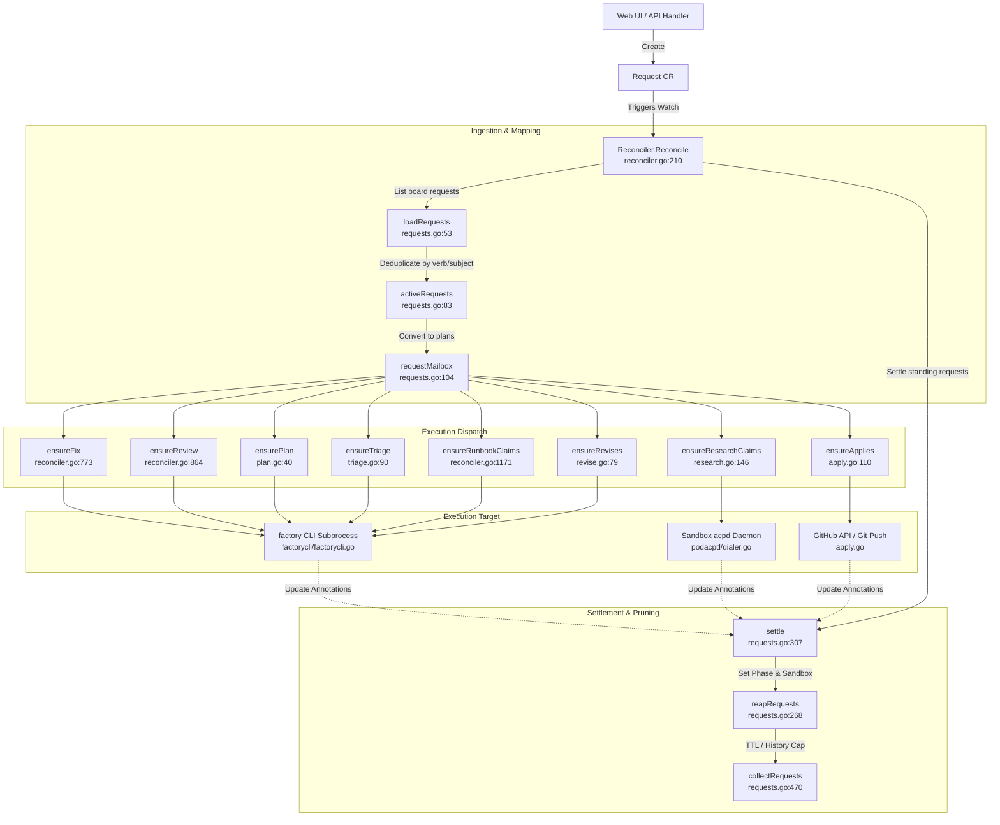

# Repo-Agent Controller: Request Lifecycle and Work Dispatch

## Summary

The `repo-agent` controller turns user-initiated UI actions into asynchronous task executions by reconciling `Request` custom resources (`board.gemini.google.com/v1alpha1`). Instead of directly executing tasks upon receiving API requests or relying on mutable annotations, the system records each click as a distinct `Request` object. The `RepoBoard` controller watches these objects, deduplicates active requests by verb and subject, translates them into internal execution plans, and dispatches tasks by executing the `factory` CLI as attached subprocesses or dialing sandbox daemons. Request phases (`Pending` $\rightarrow$ `Launching` $\rightarrow$ `Running` $\rightarrow$ `Succeeded` / `Failed`) are updated based on sandbox annotations and execution results, after which terminal requests are garbage collected.

---

## Architectural Findings

### 1. Request CRD Structure & Lifecycle

`Request` objects represent individual click intentions and short-lived execution receipts (`repo-agent/api/repoboard/v1alpha1/request_types.go:21-48`).

* **CRD Schema & Fields:** Defined in `repo-agent/api/repoboard/v1alpha1/request_types.go:197-205`. Key fields include:
  * `spec.board`: The owning `RepoBoard` name (`request_types.go:142`).
  * `spec.verb`: The requested action (`fix`, `review`, `triage`, `plan`, `iterate`, `address`, `investigate`, `run`, `research`, `apply`, `revise`) (`request_types.go:146`).
  * `spec.member`: The namespace whose identity and credentials run the task (`request_types.go:153`).
  * `spec.number`: The associated GitHub issue or pull request number (`request_types.go:158`).
  * Verb-specific payload blocks: `spec.run` (`RunRequest`), `spec.research` (`ResearchRequest`), and `spec.apply` (`ApplyRequest`).
* **Phase Progression:**
  * `Pending`: Filed, awaiting controller reconciliation or quota availability (`request_types.go:50-52`).
  * `Launching`: Stamped immediately prior to invoking non-idempotent actions (e.g., `run` deployments) to ensure controller crashes do not cause duplicate provisioning (`request_types.go:53-58`, `repo-agent/pkg/controllers/repoboard/requests.go:198-218`).
  * `Running`: The task subprocess or in-sandbox container execution is in flight (`request_types.go:59-60`).
  * `Succeeded` / `Failed`: Terminal states indicating task completion or unrecoverable error (`request_types.go:61-72`).

---

### 2. Reconciliation & Work Dispatch Flow

The main controller reconciliation loop is implemented in `repo-agent/pkg/controllers/repoboard/reconciler.go:210-385`.

#### Step-by-Step Dispatch Pipeline:
1. **Watch Trigger:** `Reconciler.SetupWithManager` watches `RepoBoard` and owns `Request` resources (`reconciler.go:1747-1756`).
2. **Loading & Deduplication:**
   * `loadRequests()` lists all requests in the board namespace matching `board.gemini.google.com/board` (`requests.go:53-73`).
   * `activeRequests()` filters non-terminal requests, keeping the oldest request per `Key()` (`spec.Verb + "/" + spec.Subject()`) to collapse accidental double clicks (`requests.go:83-98`).
3. **Plan Mapping (`requestMailbox`):** Converts deduplicated requests into internal dispatch types (`requests.go:104-138`):
   * `VerbFix` $\rightarrow$ `fixPlan{issue, executor}`
   * `VerbReview` $\rightarrow$ `reviewPlan{pr, executor}`
   * `VerbTriage` $\rightarrow$ `triageClick{issue, member, request}`
   * `VerbPlan` $\rightarrow$ `planRequest{issue, member}`
   * `VerbRun` $\rightarrow$ `runbookClaim`
   * `VerbResearch` $\rightarrow$ `researchClaim`
   * `VerbIterate` / `VerbAddress` / `VerbInvestigate` $\rightarrow$ `prTaskClaim`
4. **Subprocess Dispatch:**
   * Execution delegates to `factorycli.Launcher` (`repo-agent/pkg/factorycli/factorycli.go`). `repo-agent` does not import `factory` as a Go module; interaction happens entirely via CLI subprocess execution (e.g., `factory fix`, `factory review`, `factory plan`, `factory run`) attaching to existing Kubernetes sandboxes.
   * Research conversations dial the in-sandbox `acpd` daemon using `podacpd.Dialer` (`repo-agent/pkg/podacpd/dialer.go`).
   * Apply operations directly execute GitHub writes or git operations (`repo-agent/pkg/controllers/repoboard/apply.go:110-145`).

---

### 3. Settlement and Garbage Collection

Settlement and cleanup occur during the trailing phase of the reconcile loop via `reapRequests()` (`requests.go:268-301`):

* **Phase Settlement (`settle`):** Evaluates sandbox annotations and launcher process outcomes (`requests.go:307-400`):
  * For `fix`, `review`, `triage`, and `plan`, a request is marked `Succeeded` once the corresponding sandbox contains completion timestamps/annotations (e.g., `AnnotationPlannedAt`, `AnnotationTriagedAt`).
  * For `run`, `settleRun` inspects process execution results via `r.Factory.LastResult()` or detects interrupted tasks across controller restarts using `sandbox.gemini.google.com/last-task-state` (`requests.go:374-453`).
  * If a request remains unfulfilled past `pendingTTL` (24 hours), it transitions to `Failed` (`requests.go:408-417`).
* **Garbage Collection (`collectRequests`):** Deletes terminal requests (`requests.go:470-515`):
  * **Success TTL:** 1 hour (`succeededTTL`).
  * **Failure TTL:** 7 days (`failedTTL`).
  * **History Cap:** Maximum 5 terminal requests retained per `(Verb, Subject)` pair (`maxHistory = 5`).
  * Superseded failure cleanup: If a subsequent request on the same subject succeeds, older failure receipts are pruned immediately.

---

### 4. Primary Code Files

| File | Purpose |
| :--- | :--- |
| `repo-agent/api/repoboard/v1alpha1/request_types.go` | CRD definitions, verb constants, and status structures. |
| `repo-agent/pkg/controllers/repoboard/requests.go` | Ingestion (`loadRequests`), mailbox mapping (`requestMailbox`), phase transitions (`settle`), and cleanup (`collectRequests`). |
| `repo-agent/pkg/controllers/repoboard/reconciler.go` | Reconcile loop entry point and orchestrator for `ensureFix`, `ensureReview`, and `ensureRunbookClaims`. |
| `repo-agent/pkg/controllers/repoboard/plan.go` | Planning workflow dispatch (`ensurePlan`). |
| `repo-agent/pkg/controllers/repoboard/triage.go` | Issue triage recipe dispatch (`ensureTriage`). |
| `repo-agent/pkg/controllers/repoboard/research.go` | Deep research session initialization (`ensureResearchClaims`). |
| `repo-agent/pkg/controllers/repoboard/apply.go` | Direct draft publication without sandbox creation (`ensureApplies`). |
| `repo-agent/pkg/controllers/repoboard/revise.go` | Plan and notes revision execution (`ensureRevises`). |
| `repo-agent/pkg/factorycli/factorycli.go` | Interface and execution wrappers for the `factory` CLI binary. |

---

## Open / Unresolved Items

* **Cross-Namespace Sandbox Loading:** When shared boards interact with member sandboxes, `loadSandboxes` must explicitly list across multiple namespaces (`reconciler.go:303-336`). The exact security boundary and RBAC requirements for multi-tenant shared boards versus personal single-namespace boards remain dependent on the cluster's secret layout (`github-pat` location).
* **Process Watcher Disconnects:** If the controller pod restarts during an attached `factory run` or long-running agent turn, recovery relies on inspecting sandbox annotations (`sandbox.gemini.google.com/last-task-state`) within a 2-hour grace window (`requests.go:429-453`). Tasks that hang indefinitely without updating sandbox annotations must time out before the request is failed.
